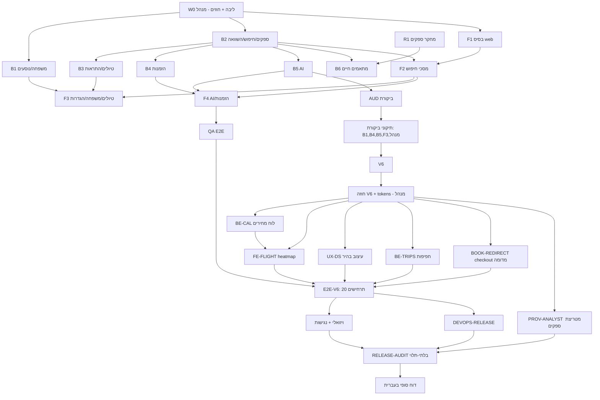

# גרף תלויות בין משימות

```mermaid
graph TD
  W0[W0 ליבה + חוזים - מנהל] --> B1[B1 משפחה/נוסעים]
  W0 --> B2[B2 ספקים/חיפוש/השוואה]
  W0 --> F1[F1 בסיס web]
  R1[R1 מחקר ספקים] --> B6[B6 מתאמים חיים]
  B2 --> B3[B3 טיולים/התראות]
  B2 --> B4[B4 הזמנות]
  B2 --> B5[B5 AI]
  B2 --> B6
  F1 --> F2[F2 מסכי חיפוש]
  B2 --> F2
  F2 --> F3[F3 טיולים/משפחה/הגדרות]
  B1 --> F3
  B3 --> F3
  F2 --> F4[F4 AI/הזמנות]
  B4 --> F4
  B5 --> F4
  F4 --> QA[QA E2E]
  B5 --> AUD[AUD ביקורת]
  AUD --> FIX[תיקוני ביקורת: B1,B4,B5,F3,מנהל]
  FIX --> V6[V6]
  V6 --> CONTRACT[חוזה V6 + tokens - מנהל]
  CONTRACT --> BECAL[BE-CAL לוח מחירים]
  CONTRACT --> FEF[FE-FLIGHT heatmap]
  CONTRACT --> UXDS[UX-DS עיצוב בהיר]
  CONTRACT --> BETRIPS[BE-TRIPS חפיפות]
  CONTRACT --> REDIR[BOOK-REDIRECT checkout מדומה]
  CONTRACT --> PROV[PROV-ANALYST מטריצת ספקים]
  BECAL --> FEF
  FEF --> E2E[E2E-V6: 20 תרחישים]
  UXDS --> E2E
  BETRIPS --> E2E
  REDIR --> E2E
  QA --> E2E
  E2E --> VIS[ויזואלי + נגישות]
  E2E --> REL[DEVOPS-RELEASE]
  VIS --> RA[RELEASE-AUDIT בלתי-תלוי]
  REL --> RA
  PROV --> RA
  RA --> REPORT[דוח סופי בעברית]
```

**נתיב קריטי:** חוזה V6 ← BE-CAL ← FE-FLIGHT ← E2E-V6 ← RELEASE-AUDIT ← דוח.
